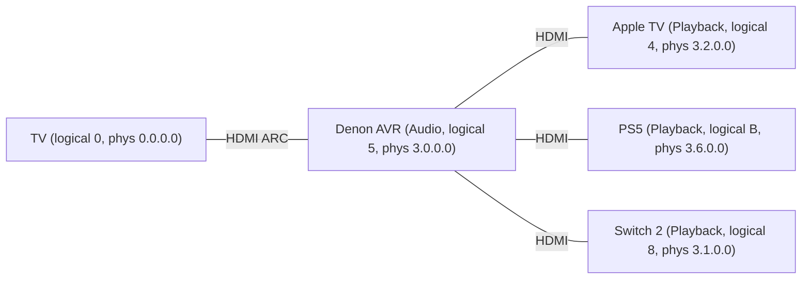
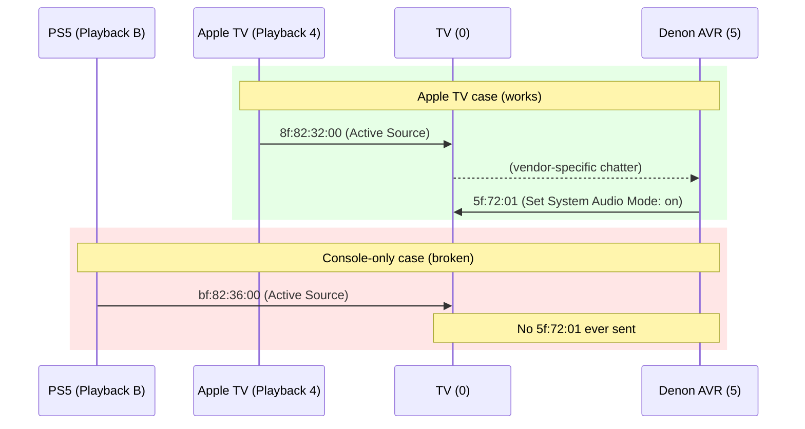
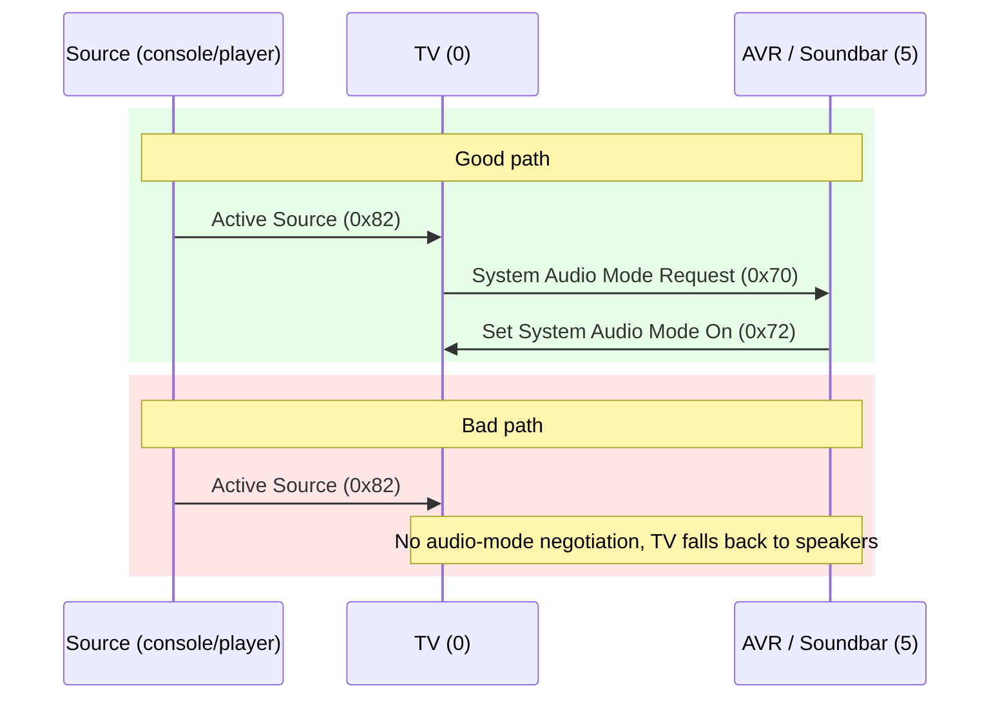

For years I treated HDMI-CEC like a house spirit: sometimes helpful, mostly temperamental, never fully understood. My living-room stack is straightforward: Samsung TV on [ARC](https://en.wikipedia.org/wiki/HDMI#ARC_and_eARC), Denon AVR-X1700H hidden in a closet, Apple TV plus a stack of consoles hanging off the receiver, and a [Raspberry Pi 4](https://www.raspberrypi.com/products/raspberry-pi-4-model-b/) already doing [Homebridge](https://homebridge.io/) duty. Apple TV behaves like demo hardware from Cupertino; every console behaves like it missed the last week of CEC school. They wake the TV, switch the input, then leave the Denon asleep so I’m back to toggling audio outputs by hand.


Rewiring wasn’t an option and disabling CEC wasn’t politically viable (people like Apple TV’s magic), so the question became: can I fix it with the gear I own, ideally with one more $5 micro-HDMI cable? The short version: yes. The Pi now sits quietly on the HDMI bus, watching for consoles to announce themselves and issuing the single command Samsung + Denon should have exchanged on their own.

This write-up mirrors the structure of my notebook: build a small mental model of CEC, sniff the bus, copy whatever Apple TV does right, wrap it in Python, then ship it as a [systemd](https://www.freedesktop.org/wiki/Software/systemd/) unit. Along the way I’ll point out where you can drop in photos/diagrams; shoot those once you have daylight.

## A tiny HDMI-CEC primer (just enough to be dangerous)

[HDMI-CEC](https://en.wikipedia.org/wiki/Consumer_Electronics_Control) is a low-bandwidth side channel that rides alongside HDMI video/audio. Everyone on the bus speaks in logical addresses (`0` for TV, `5` for audio systems, `4/8/9/B` for playback devices) and tiny opcodes such as `0x82` (**Active Source**) or `0x72` (**Set System Audio Mode**). Physical addresses are “lat/long” references inside the topology—`3.0.0.0` might mean “behind the AVR on HDMI 3”.

In a healthy system the flow goes like this: console wakes and declares itself active, the TV notices there’s an ARC partner, somebody sends “please be the audio system”, the receiver wakes up, and audio never leaves the big speakers. That path only fired when Apple TV was involved.

Here are the specific CEC roles that mattered in my stack:

- **TV** – logical address `0`
- **Audio system (Denon AVR-X1700H)** – logical address `5`
- **Playback devices** – logical addresses `4`, `8`, `9`, `B` (Apple TV, PS5, Switch 2, etc.)
- **Broadcast** – logical address `F` (messages to everyone)

And the key opcodes we ended up caring about:

- `0x82` – **Active Source** (“I am now the active input”)
- `0x84` – **Report Physical Address** (“this is where I live in the HDMI tree”)
- `0x70` – **System Audio Mode Request**
- `0x72` – **Set System Audio Mode** (Denon’s “I am now the audio system” broadcast)

Topology-wise, it looks like this:



## Sniffing the CEC bus with `cec-client`

The Raspberry Pi exposes `/dev/cec0` on its micro-HDMI ports and Pulse-Eight’s [`libcec`](https://github.com/Pulse-Eight/libcec) gives us `cec-client`. Install it, run:

```bash
echo "scan" | cec-client -s
```

Make sure your devices show up, then park on:

```bash
cec-client -m -d 8
```

to record traffic. That command keeps the Pi quiet (monitor mode) yet gives you every bus transaction.

The `-d` flag is a bitmask of log levels (`ERROR=1`, `WARNING=2`, `NOTICE=4`, `TRAFFIC=8`, `DEBUG=16`), which is why something like `-d 4` might show nothing interesting; the truth is hiding in [`cectypes.h`](https://github.com/Pulse-Eight/libcec/blob/95d1c6965e38000f56776f4563f9763832a5a7c2/include/cectypes.h#L835-L843).

Example scan output from my setup:

```text
CEC bus information
===================
device #0: TV
address:       0.0.0.0
vendor:        Samsung

device #5: Audio
address:       3.0.0.0
vendor:        Denon

device #4: Playback 1 (Apple TV)
address:       3.2.0.0
vendor:        Apple

device #8: Playback 2 (Switch 2)
address:       3.1.0.0
vendor:        Unknown

device #B: Playback 3 (PlayStation 5)
address:       3.6.0.0
vendor:        Sony
```

A line such as:

```text
TRAFFIC: [...] >> bf:82:36:00
```

reads as: logical `B` (PS5) broadcast Active Source (`0x82`) with physical address `3.6.0.0`. That’s the packet you expect any console to send when it wakes up.


There’s one more `cec-client` detail that’s surprisingly under-documented: **log levels**. The enum in `libcec` looks like this:

```c
typedef enum cec_log_level
{
  CEC_LOG_ERROR   = 1,
  CEC_LOG_WARNING = 2,
  CEC_LOG_NOTICE  = 4,
  CEC_LOG_TRAFFIC = 8,
  CEC_LOG_DEBUG   = 16,
  CEC_LOG_ALL     = 31
} cec_log_level;
```

So `-d 8` means “traffic only.” I originally tried `-d 4` (notice) and saw nothing when turning on Apple TV, which led to a small detour through `libcec`’s source. If you’ve ever wondered why `-d 4` seems useless for debugging CEC flows, that’s why.

## Apple TV vs everyone else

Put the system in standby, start logging, then wake Apple TV. You get the expected `Active Source` burst, followed immediately by the Denon broadcasting that it has taken over audio:

```text
>> 8f:82:32:00       # Apple TV (logical 8) -> Broadcast: Active Source
...
>> 5f:72:01          # Denon (logical 5) -> Broadcast: Set System Audio Mode (on)
```

Translated:

1. Apple TV announces itself as the active source.
2. Very soon after, the Denon tells everyone “System Audio Mode is on,” and the TV happily keeps output set to **Receiver** instead of flipping back to TV speakers.

Do the exact same experiment with PS5 or Switch 2 and the second packet never arrives:

```text
>> bf:82:36:00       # PS5: Active Source
# ...a bunch of reports, but no 5f:72:01
```

This is where some Apple-specific magic shows up. When Apple TV is in the mix, I also see vendor-specific commands like:

```text
>> 4f:a6:06:10:56:10
```

Opcode `0xA6` is vendor-defined; Samsung and Apple have a private handshake here that ultimately results in the Denon doing the right thing. It’s neat, but we don’t actually need to understand it. The important bit is the boring, standards-based packet that **fixes** the problem:

```text
5f:72:01    # Audio (5) -> Broadcast (F): Set System Audio Mode (on)
```

And, more portably, the **request** that reliably causes that response:

```text
15:70:00:00 # TV (1) -> Audio (5): System Audio Mode Request
```

The moment I typed this into `cec-client`’s interactive shell:

```text
tx 15:70:00:00
```

…the Denon sprang to life and ARC anchored to the receiver even with only a console and TV powered on. That’s the whole trick: copy the **effect** of the secret Apple/Samsung/Denon dance with a single, documented CEC opcode.


Here’s a simplified “good vs bad” handshake timeline:



All we’re going to do is watch for the “console-only” trace and inject the missing `15:70:00:00` on the TV’s behalf.

## Don’t spam the bus

Most forum scripts loop `cec-client` every few seconds and blast `on 5`. That sort of works, but it’s wasteful, slow, and blind:

* Every iteration spins up a new `cec-client`, binds to `/dev/cec0`, sends one command, and tears down.
* You’re guessing about timing instead of reacting to actual CEC events.
* You’re treating CEC like a write-only GPIO instead of a chatty shared bus.

A better pattern is:

1. Start a **single** long-lived `cec-client` process.
2. Let it print every `TRAFFIC` line for you to parse.
3. Feed it `tx ...` commands on stdin only when you need to intervene.

The only catch: monitor mode (`-m`) can’t transmit. So for the automation we switch to:

```bash
cec-client -d 8
```

No `-m` here. `cec-client` still prints all the traffic, but now it also accepts commands. Our Python script treats it like a Unixy bridge between HDMI land and our own logic: stdout is an event stream, stdin is a control channel.

## The Python script

Below is the trimmed version that runs on my Pi. It:

* Starts `cec-client -d 8` as a subprocess.
* Parses `TRAFFIC` lines.
* Watches for **Active Source (`0x82`)** from any **Playback** logical address (`4/8/9/B`).
* Tracks when the Denon last broadcast **Set System Audio Mode (`5f:72:01`)** so we don’t fight Apple TV or the TV’s own logic.
* Sends `tx 15:70:00:00` at most once per console wake if nobody else has done it.

Drop it into `/opt/cec-auto-audio/cec_auto_audio.py` (or similar) on the Pi.

```python
#!/usr/bin/env python3
"""
cec_auto_audio.py

Watch HDMI-CEC traffic on a Raspberry Pi and nudge the AVR (Denon)
to become the system audio device when a console becomes Active Source.

Requires:
  - libcec / cec-client installed
  - Raspberry Pi's HDMI-CEC interface exposed as /dev/cec0
"""

import subprocess
import sys
from datetime import datetime, timedelta

# Logical address of the audio system (Denon AVR)
LOGICAL_AUDIO = 0x5

# Playback device logical addresses (per CEC spec)
# We treat ANY of these becoming Active Source as a "console wake".
PLAYBACK = {0x4, 0x8, 0x9, 0xB}

# How long after Active Source we’re willing to treat it as a fresh wakeup
PENDING_WINDOW = timedelta(seconds=0.5)

# If we saw a real Set System Audio Mode recently, assume Apple TV / TV
# already negotiated audio correctly and stay out of the way.
SAM_GRACE = timedelta(seconds=10)

# Path to cec-client
CEC_CLIENT = "/usr/bin/cec-client"

# Flip to True if you want to test logic without actually sending CEC commands
DRY_RUN = False


def log(level: str, msg: str) -> None:
    """Simple timestamped logger."""
    print(f"[{level} {datetime.now():%H:%M:%S}] {msg}", flush=True)


def parse_line(line: str):
    """Parse a TRAFFIC line like 'TRAFFIC: [...] >> bf:82:36:00'.

    Returns (src, dst, opcode, params) or None on failure.
    """
    if "TRAFFIC:" not in line:
        return None

    marker = ">> "
    if marker not in line:
        return None

    try:
        payload = line.split(marker, 1)[1].strip()
        # Split "bf:82:36:00" into [0xbf, 0x82, 0x36, 0x00]
        parts = [int(p, 16) for p in payload.split(":")]
        if len(parts) < 2:
            return None

        # First byte encodes src/dst nibbles
        src, dst = divmod(parts[0], 0x10)
        opcode = parts[1]
        params = parts[2:]
        return src, dst, opcode, params
    except Exception:
        return None


class AutoAudio:
    """State machine that wraps a long-lived cec-client process."""

    def __init__(self):
        # Start cec-client in normal (non-monitor) mode at TRAFFIC level.
        # This gives us all bus traffic and allows tx commands via stdin.
        self.proc = subprocess.Popen(
            [CEC_CLIENT, "-d", "8"],
            stdin=subprocess.PIPE,
            stdout=subprocess.PIPE,
            stderr=subprocess.STDOUT,
            text=True,
            bufsize=1,  # line-buffered
        )

        # pending = (src_logical, phys_str, time_of_active_source)
        self.pending = None
        self.last_sam = datetime.min  # last time we saw 5f:72:01

    def send(self, cmd: str) -> None:
        """Send a single CEC command line to cec-client (e.g., 'tx 15:70:00:00')."""
        if DRY_RUN:
            log("AUTO", f"[DRY RUN] Would send: {cmd}")
            return

        if not self.proc.stdin:
            log("ERROR", "cec-client stdin is not available.")
            return

        try:
            self.proc.stdin.write(cmd + "\n")
            self.proc.stdin.flush()
            log("AUTO", f"Sent: {cmd}")
        except Exception as e:
            log("ERROR", f"Failed to send '{cmd}' to cec-client: {e}")

    def maybe_nudge(self) -> None:
        """If the conditions are right, send System Audio Mode Request once."""
        if not self.pending:
            return

        src, phys, t0 = self.pending
        now = datetime.now()

        # If it’s been too long since Active Source, give up.
        if now - t0 > PENDING_WINDOW:
            self.pending = None
            return

        # If we saw a recent real System Audio Mode broadcast, stay passive.
        if now - self.last_sam < SAM_GRACE:
            self.pending = None
            return

        log(
            "AUTO",
            f"Playback/console at logical {src:X} ({phys}) is active "
            f"and no recent System Audio Mode seen; sending request."
        )
        # TV (1) -> Audio (5): System Audio Mode Request (0x70) for phys 0.0.0.0 (TV)
        self.send("tx 15:70:00:00")
        self.pending = None

    def handle(self, src: int, dst: int, opcode: int, params: list[int]) -> None:
        """Handle a parsed CEC frame."""

        # Denon broadcasting System Audio Mode On: 5f:72:01
        if src == LOGICAL_AUDIO and opcode == 0x72 and params[:1] == [0x01]:
            self.last_sam = datetime.now()
            self.pending = None
            log("INFO", "Denon broadcast System Audio Mode On (5f:72:01).")
            return

        # Active Source from any playback device
        if opcode == 0x82:
            phys = ":".join(f"{p:02x}" for p in params[:2]) or "??"

            if src in PLAYBACK:
                self.pending = (src, phys, datetime.now())
                log(
                    "AUTO",
                    f"Playback/console at logical {src:X} became Active Source (phys {phys})."
                )
                # Try to nudge immediately; if the AVR or TV does the right thing
                # in the next few ms and we see 5f:72:01, SAM_GRACE will suppress us.
                self.maybe_nudge()
            else:
                # Something else (TV, AVR, etc.) became active; cancel any pending console wake.
                self.pending = None

    def loop(self) -> None:
        """Main loop: read lines from cec-client and feed the state machine."""
        if not self.proc.stdout:
            log("ERROR", "cec-client stdout is not available.")
            return

        for line in self.proc.stdout:
            # Mirror raw cec-client output into the journal/terminal
            print(line, end="", flush=True)

            parsed = parse_line(line)
            if not parsed:
                continue

            self.handle(*parsed)

        log("ERROR", "cec-client exited; stopping helper.")


def main() -> None:
    log("INFO", f"Starting CEC auto-audio watcher (DRY_RUN={DRY_RUN})")
    helper = AutoAudio()
    helper.loop()


if __name__ == "__main__":
    try:
        main()
    except KeyboardInterrupt:
        log("INFO", "Interrupted, exiting.")
        sys.exit(0)
```

A few notes:

* The script **doesn’t hard-code** anything about PS5 / Switch names, vendors, or physical addresses.
* It treats **any Playback logical address** (`4/8/9/B`) turning into Active Source as a “console wake” event.
* It stays **passive** when Apple TV / Samsung / Denon manage to do the right thing themselves (because we observe a real `5f:72:01`).
* It runs as a single long-lived process tied to a single `cec-client` instance.

You can temporarily set `DRY_RUN = True` while sniffing behavior; you’ll see log lines like:

```text
[AUTO 00:18:19] Playback/console at logical B became Active Source (phys 36:00).
[AUTO 00:18:20] [DRY RUN] Would send: tx 15:70:00:00
```

Once you’re happy, flip `DRY_RUN = False`.

## Running it as a systemd service

On the Pi, create a service file:

```bash
sudo nano /etc/systemd/system/cec-auto-audio.service
```

Example unit:

```ini
[Unit]
Description=CEC auto audio helper (Denon + consoles)
After=network.target

[Service]
Type=simple
ExecStart=/usr/bin/python3 /opt/cec-auto-audio/cec_auto_audio.py
Restart=on-failure
User=pi
Group=pi
WorkingDirectory=/opt/cec-auto-audio
StandardOutput=journal
StandardError=journal

[Install]
WantedBy=multi-user.target
```

Then:

```bash
sudo systemctl daemon-reload
sudo systemctl enable cec-auto-audio.service
sudo systemctl start cec-auto-audio.service

# Tail logs
journalctl -u cec-auto-audio.service -f
```

Because we print both our own `[INFO]` / `[AUTO]` lines and the raw `cec-client` output, the journal doubles as a trace buffer. `journald` handles rotation automatically; you don’t need to babysit log files.

## Generalizing this approach

Maybe your pain point isn’t consoles; maybe DTS never negotiates, or your TV keeps snapping back to its tiny speakers. The workflow is the same:

1. **Get the Pi onto the ARC port**
   Plug the Pi into the TV’s ARC/eARC HDMI input using a micro-HDMI–>HDMI cable (or adapter). Put it somewhere it can live forever.

2. **Baseline the bus**
   Run `echo "scan" | cec-client -s` to see what devices exist, what logical roles they claim, and where they sit physically.

3. **Record a “good” scenario and a “bad” one**
   Use `cec-client -m -d 8` to log traffic while you:

   * Trigger a **good** path (e.g., Apple TV gets 5.1 sound correctly).
   * Trigger a **bad** path (e.g., DTS falls back to stereo, or ARC drops to TV speakers).

4. **Diff the traces**
   Look for opcodes that show up in the good trace but are missing in the bad. In my case, the interesting delta was the presence of `5f:72:01` after Apple TV woke, and the absence of anything like it when a console woke alone.

5. **Inject the missing opcode by hand**
   Drop into `cec-client` interactive mode, send `tx ...` for your suspected magic packet, and see if reality changes.

6. **Wrap it in code**
   Once you know the magic packet, wrap it in a tiny program like the one above and let the Pi quietly participate on the bus.

You can picture the good vs bad paths like this:



Your job is to spot the missing step and teach the Pi to do it.


## Where this leaves my setup

Apple TV keeps doing its thing. PS5 or Switch now wake the TV, the helper nudges the Denon within half a second, and audio stays glued to the receiver. Latency is low enough that it feels native. The Pi sits in the closet pretending to be a slightly overqualified remote.


There’s probably a small cottage industry of “two-page CEC scripts” waiting to be written. If you adapt this trick for some other HDMI-CEC horror story, send me the packet traces—I’m collecting folklore.