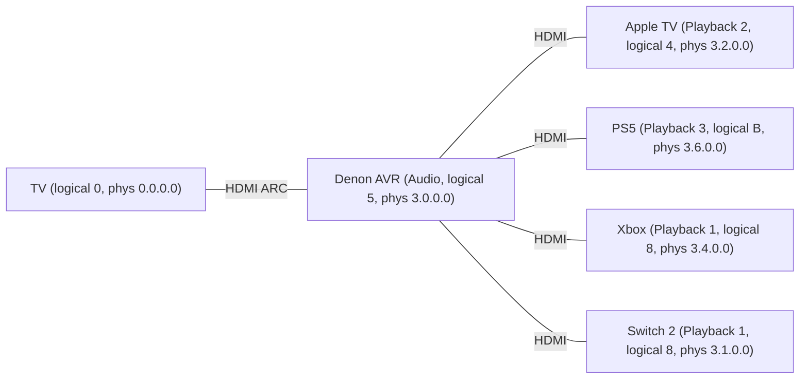
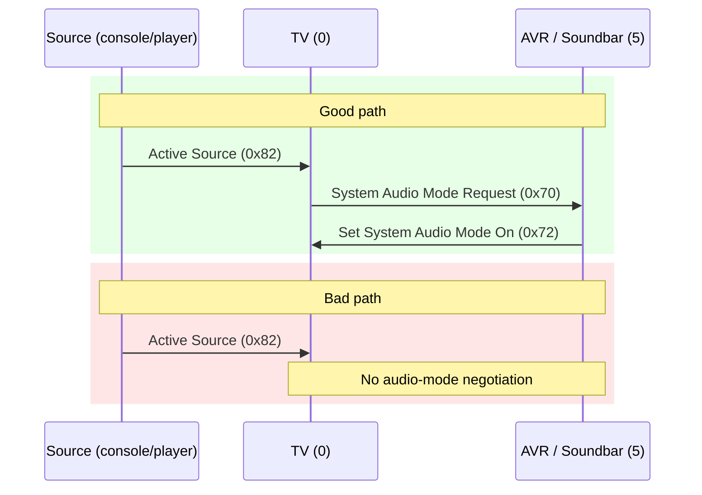

For years I treated [HDMI-CEC](https://en.wikipedia.org/wiki/Consumer_Electronics_Control) like a house spirit: sometimes helpful, mostly temperamental, never fully understood. My living-room stack is straightforward: Samsung TV on [ARC](https://en.wikipedia.org/wiki/HDMI#ARC_and_eARC) (NOT eARC - story for another day), Denon AVR-X1700H hidden in a closet, Apple TV plus a bunch of consoles connected to the receiver, and a [Raspberry Pi 4](https://www.raspberrypi.com/products/raspberry-pi-4-model-b/) already doing [Homebridge](https://homebridge.io/) duty. When it comes to CEC, the Apple TV handles it like a dream, but every console behaves like it missed the last week of CEC school. They wake the TV, switch the input, then leave the Denon asleep so I’m back to toggling audio outputs manually.


> I documented the [media closet build-out](/posts/media-closet/) separately, so if you want the full wiring tour (and the before/after photos), start there.

With the media closet, rewiring everything to the TV wasn’t an option and disabling CEC wasn’t viable (Apple TV works and it gets the most use). My first instinct was to lean on traditional automation stacks: HomeKit scenes to chain “TV on” into “receiver on” or wattage triggers via an [Eve Energy](https://www.evehome.com/en/eve-energy) plug. This kind of worked, but every extra layer added 30 seconds of lag or more. The last stop on that journey was a [`homebridge-cec-tv-control` plugin](https://github.com/electroflame/homebridge-cec-tv-control), but while reading the README I realized I was about to pipe CEC messages through Node, Homebridge, and HomeKit before they hit the receiver. *The Pi is wired into the rack already, so skipping those layers and going through `/dev/cec0` directly was clearly the faster path.*

After an evening of struggling, the Pi now sits quietly on the HDMI bus, watching for consoles to announce themselves and issuing the single command Samsung + Denon should have exchanged on their own.

This post follows the structure of my notes: build a small mental model of CEC, monitor the bus, copy whatever Apple TV does right, wrap it in Python, then ship it as a [systemd](https://systemd.io) unit.

## Small HDMI-CEC primer

*[High-Definition Multimedia Interface](https://en.wikipedia.org/wiki/HDMI) [Consumer Electronics Control](https://en.wikipedia.org/wiki/Consumer_Electronics_Control)*, much better known as **HDMI-CEC**, is a low-bandwidth side channel that rides alongside HDMI video/audio. Everyone on the bus speaks in *logical addresses* (`0` for TV, `5` for audio systems, `4/8/B`[^hex] for playback devices, etc.) and tiny *opcodes*[^cec-frame] such as `0x82` (**Active Source**) or `0x72` (**Set System Audio Mode**). Physical addresses are “lat/long” references inside the topology, so `3.0.0.0` can mean “AVR input source HDMI 3”.

[^hex]: CEC logical addresses are usually written in hex, so `11` decimal = `0xB` hex = `Playback 3`.

[^cec-frame]: Super confusing, using https://www.cec-o-matic.com is really helpful.

CEC is *supposed to* help consumers control their electronics, so in a healthy system the flow goes like this: console wakes and declares itself active, the TV notices there’s an ARC partner, somebody sends “please be the audio system”, the receiver wakes up, and audio comes out of the big speakers. For me, that path only occurred when Apple TV was involved. Sadly, when I woke a console, the TV switched inputs but audio stayed on the tinny TV speakers.

To debug that mess I first wrote down how every device identified itself on the bus. Here are the specific CEC roles in my home theater:

- **TV** – logical address `0`
- **Audio system (Denon AVR-X1700H)** – logical address `5`
- **Playback devices** – logical addresses `4`, `8`, `B` (Apple TV, PS5, Switch 2 and Xbox all competing for the three playback slots[^playback-limit])
- **Broadcast** – logical address `F` (messages to everyone)

[^playback-limit]: Amazingly, HDMI-CEC only defines only [**three** playback logical addresses](https://feintech.eu/en/blogs/know-how/wozu-dient-hdmi-cec): `4` (Playback 1), `8` (Playback 2), and `11` (`0xB`) (Playback 3). That’s fine if you have one streaming box and a couple of consoles. I had **four** playback-class boxes (Apple TV, PS5, Switch 2, Xbox) connected to the Denon. According to HDMI-CEC, only three of them can ever be “real” playback devices at once, so when the fourth one wakes up the TV and AVR have to reshuffle logical addresses on the fly. In practice this looked unhinged: if the Switch was on, changing input to Xbox was impossible, I'd get a quick black screen and the input snaps back to Xbox. None of this was a Samsung or Denon bug; it was just me exceeding the three-playback-device limit baked into the CEC spec.

Topology-wise, it looks like this:



And the key opcodes we ended up caring about:

- `0x82` – **Active Source** (“I am now the active input”)
- `0x84` – **Report Physical Address** (“this is where I live in the HDMI tree”)
- `0x70` – **System Audio Mode Request**
- `0x72` – **Set System Audio Mode** (Denon’s “I am now the audio system” broadcast)

## Monitoring the CEC bus with `cec-client`

The Raspberry Pi 4 I have exposes `/dev/cec0` interface on its micro-HDMI, and with a $5 micro-HDMI to HDMI cable plugged into HDMI input port on the receiver, it's possible to monitor CEC traffic from *everything connected to the receiver*.


And [`libcec`](https://github.com/Pulse-Eight/libcec) gives us `cec-client`. To install it, use `sudo apt install cec-utils`. Then run a quick scan to see what devices are on the bus:

```bash
echo "scan" | cec-client -s
```

Example scan output from my setup:

```text
CEC bus information
===================
device #0: TV
address:       0.0.0.0
active source: no
vendor:        Samsung
osd string:    TV
CEC version:   1.4
power status:  on
language:      eng


device #1: Recorder 1
address:       3.3.0.0
active source: no
vendor:        Pulse Eight
osd string:    CECTester
CEC version:   1.4
power status:  on
language:      eng


device #4: Playback 1
address:       3.1.0.0
active source: yes
vendor:        Unknown
osd string:    Switch 2
CEC version:   1.3a
power status:  on
language:      ???


device #5: Audio
address:       3.0.0.0
active source: no
vendor:        Denon
osd string:    AVR-X1700H
CEC version:   1.4
power status:  on
language:      ???


device #8: Playback 2
address:       3.2.0.0
active source: no
vendor:        Apple
osd string:    Apple TV
CEC version:   2.0
power status:  standby
language:      ???


device #B: Playback 3
address:       3.6.0.0
active source: no
vendor:        Sony
osd string:    PlayStation 5
CEC version:   1.3a
power status:  standby
language:      ???
```

If the expected devices show up, use monitor mode with the correct level[^log] of logging:

```bash
cec-client -m -d 8
```

This command keeps the Pi quiet (monitor mode) yet gives you every bus transaction.

[^log]: the `-d` flag is a bitmask of log levels (`ERROR=1`, `WARNING=2`, `NOTICE=4`, `TRAFFIC=8`, `DEBUG=16`, `ALL=31`), which is why something like `-d 4` might show nothing interesting; the truth is hiding in [`libcec` source code](https://github.com/Pulse-Eight/libcec/blob/95d1c6965e38000f56776f4563f9763832a5a7c2/include/cectypes.h#L835-L843). So `-d 8` means “traffic only.” I originally tried `-d 4` (notice) and saw nothing when turning on Apple TV, which led to a small detour through `libcec`’s source. This was surprisingly under-documented and many sources had misleading info about it. 

A line such as `TRAFFIC: [...] >> bf:82:36:00` means: logical `B` (PS5) broadcast Active Source (`0x82`) with physical address `3.6.0.0`. That’s the packet you expect any console to send when it wakes up.

## Figuring out the magic handshake

So I put the system in standby, start logging, then wake Apple TV. I got the expected `Active Source` burst, followed immediately by the Denon broadcasting that it has taken over audio:

```text
>> 8f:82:32:00       # Apple TV (logical 8) -> Broadcast: Active Source
...
>> 8f:a6:06:10:56:10 # Apple TV (logical 8) -> Denon (logical 5): ???
>> 5f:72:01          # Denon (logical 5) -> Broadcast: Set System Audio Mode (on)
```

Translated:

1. Apple TV announces itself as the active source.
2. Apple TV sends some magic bits to the Denon??
3. Very soon after, the Denon tells everyone “System Audio Mode is on,” and the TV happily keeps output set to **Receiver** instead of flipping back to TV speakers.

I did the exact same experiment with PS5, Xbox, Switch 2 and the result was different:

```text
>> bf:82:36:00       # PS5: Active Source
# ...a bunch of reports, but no 5f:72:01
```

So what was the `8f:a6:06:10:56:10` frame when Apple TV was involved? With debug logs, `cec-client` showed `UNKNOWN (A6)`. So, opcode `A6` is not a standard CEC opcode, so `libCEC` labels it unknown because it’s in the vendor-specific range. The following bytes (`06:10:56:10`) could be Apple’s proprietary payload, like some capability or extended control. It's possible Samsung and Apple have a private handshake here that ultimately results in the Denon doing the right thing. It’s neat, but I couldn't rely on it since it’s undocumented and sending it manually from the Raspberry Pi's logical address had no effect. Impersonating Apple TV over CEC is not realistically viable and likely brittle.

However, with [cec-o-matic.com](https://www.cec-o-matic.com), it was easy to craft a CEC frame for the Raspberry Pi to send a normal system audio mode request:

```text
15:70:00:00 # TV (1) -> Audio (5): System Audio Mode Request
```

Breaking it down:
- `15` = source `1` (Recorder 1 = Pi) sends to destination 5 (Audio System = Denon)
- `70` = opcode **System Audio Mode Request**
- `00:00` = operands (TV’s physical address 0.0.0.0, plus “system audio status” = off/0, which Denon interprets as “please negotiate system audio mode and turn on ARC”)

The second I typed this into `cec-client`’s interactive shell with `tx 15:70:00:00`, the Denon turned on and ARC anchored to the receiver even with only a console and TV powered on. I confirmed by checking the TV’s audio output:


So the solution started to emerge: whenever a console wakes up and claims Active Source, the Pi should step in and send `15:70:00:00` to the Denon to kickstart audio negotiation.

## Don’t spam the bus!

The most obvious thing to do is to write a bash script that loops `cec-client` every few seconds and blast `on 5`. That sort of works, but it's not ideal:

* Using a loop means the automation is delayed instead of reacting to actual CEC events.
* Every iteration spins up a new `cec-client`, binds to `/dev/cec0`, sends one command, and tears down.
* CEC is a shared bus, not a write-only GPIO.

A better pattern is:

1. Start a **single** long-lived `cec-client` process.[^python-cec]
2. Let it print every `TRAFFIC` line for you to parse.
3. Feed it `tx ...` commands on stdin only when you need to intervene.

[^python-cec]: There are Python bindings for libCEC like [python-cec](https://pypi.org/project/cec/), but they're under-documented and I found it easier to just wrap `cec-client` as a subprocess.

The only catch: monitor mode (`-m`) can’t transmit. So for the automation we switch to:

```bash
cec-client -d 8
```

No `-m` here. `cec-client` still prints all the traffic, but now it also accepts commands. Our Python script treats it like a bridge between HDMI land and our own logic: `stdout` is an event stream, `stdin` is a control channel.

## The Python script

It took some trial and error, but it wasn't too difficult to write a small Python program that watches for consoles waking up and sends the magic `15:70:00:00` command when needed. I put it all on GitHub:



The script logic goes:

* Starts `cec-client -d 8` as a subprocess.
* Parses `TRAFFIC` lines.
* Watches for **Active Source (`0x82`)** from any **Playback** logical address (`4/8/B`).
* Tracks when the Denon last broadcast **Set System Audio Mode (`5f:72:01`)** so we don’t fight Apple TV or the TV’s own logic.
* Sends `tx 15:70:00:00` at most once per console wake if nobody else has done it.

A few notes:

* The script **doesn’t hard-code** any device names, vendors, or physical addresses.
* It treats **any Playback logical address** (`4/8/B`) turning into Active Source as a “console wake” event.
* It stays **passive** when Apple TV / Samsung / Denon manage to do the right thing themselves (because we observe a real `5f:72:01`).
* It runs as a single long-lived process tied to a single `cec-client` instance.

To make sure it starts on boot and keeps running, I wrapped it in a simple `systemd` service. The unit file looks like this:

```ini
[Unit]
Description=CEC auto audio helper (Denon + consoles)
After=network.target

[Service]
Type=simple
ExecStart=/usr/bin/python3 /opt/cec-auto-audio/cec_auto_audio.py
Restart=on-failure
User=pi
Group=pi
WorkingDirectory=/opt/cec-auto-audio
StandardOutput=journal
StandardError=journal

[Install]
WantedBy=multi-user.target
```

The full setup instructions are in the GitHub repo’s README.

## Generalizing this approach

I hope this post gives you enough of a mental model to adapt this approach to your own CEC pain points. My solution is specific to the Denon + Samsung + consoles scenario, but the same pattern should work for other CEC quirks.

Maybe your issue isn’t consoles not engaging the AVR. Maybe DTS never negotiates, or your TV keeps snapping back to its tiny speakers. The workflow is the same:

1. **Get the Pi onto the an HDMI port**. Plug the Pi into the TV or Receiver's HDMI input using a [micro-HDMI–>HDMI cable](https://www.amazon.com/dp/B06WWQ7KLV) (or adapter). Put it somewhere it can sit forever.

2. **Baseline the bus**. Run:
   
   ```bash
   echo "scan" | cec-client -s -d 1
   ```

   to make sure your Pi can see all the expected devices, what logical/physical addresses they have, and what roles they use.

3. **Record a “good” scenario and a “bad” one**. Use:
   
   ```bash
   cec-client -m -d 8
   ```
   to log traffic while you:

   * Trigger a **good** path (e.g., Apple TV gets 5.1 sound correctly).
   * Trigger a **bad** path (e.g., DTS falls back to stereo, or ARC drops to TV speakers).

4. **Diff the traces**. Look for opcodes that show up in the good trace but are missing in the bad. In my case, the interesting delta was the presence of `5f:72:01` after Apple TV woke, and the absence of anything like it when a console woke alone.

5. **Inject the missing opcode manually**. Go to [cec-o-matic.com](https://www.cec-o-matic.com) to build the missing frame[^ai], then run:
   
   ```bash
   cec-client -d 8
   ``` 
   
   to use `cec-client` in interactive mode, then type `tx ...` for your suspected magic packet, and see if anything changes. If not, try again with a different frame.

   You likely would want to start with a frame like `1f:...` (Pi logical address as Recording 1  `1` to Broadcast `F`), or `15...` (Pi to Audio System `5`), depending on what you’re trying to achieve.

6. **Wrap it in code**. Once you know the magic packet, wrap it in a tiny program like the one above and let the Pi quietly participate on the bus.

[^ai]: Using AI tools also can work here: paste your good and bad traces into something like ChatGPT and ask it to spot the differences, and suggest what CEC frames might be missing. Use a reasoning model like GPT-5.1-Thinking to get better analysis.

You can picture the good vs bad paths like this:



Your job is to spot the missing step and teach the Pi to do it.

## Where this leaves my setup

Apple TV keeps doing its thing. PS5, Xbox, or Switch now wake the TV, the Pi nudges the Denon within half a second, and audio stays glued to the receiver. Latency is low enough that it feels native. The Pi sits in the closet pretending to be a slightly overqualified remote.


There are still a couple of rough edges I haven’t tackled yet:

- **When a console goes to sleep, the TV sometimes “helpfully” switches to its antenna input.** I don’t even have an antenna plugged in, so the net effect is a confusing “no signal” screen instead of falling back to Apple TV or a known-good input. That’s technically “correct” from the TV’s point of view (its own tuner is always a valid source), but wrong for how this setup is actually used.

- **My sunset TV automation can land on a dead input.** I have a HomeKit automation that turns the TV on around sunset. Most of the time that means Apple TV wakes up with a nice aerial screensaver. But if the last input before power-off was a console, the TV wakes to that HDMI port and just shows “no signal”, which confuses other people in the house.

Both problems feel like they should be fixable with the same tooling. A future version of the Python helper could watch for “TV just powered on” and then:

1. Wait briefly to see if the TV declares itself Active Source (to avoid breaking internal apps like Netflix).
2. If nothing claims Active Source within a short timeout, explicitly switch over to Apple TV and wake it.

That would turn the Pi into a more general “HDMI shepherd”: not just keeping ARC pinned to the receiver when something is playing, but also steering the system back to a sane default when nothing is.

There’s probably a small cottage industry of “two-page CEC scripts” waiting to be written. If you adapt this trick for some other HDMI-CEC horror story, send me the packet traces—I’m collecting folklore.
